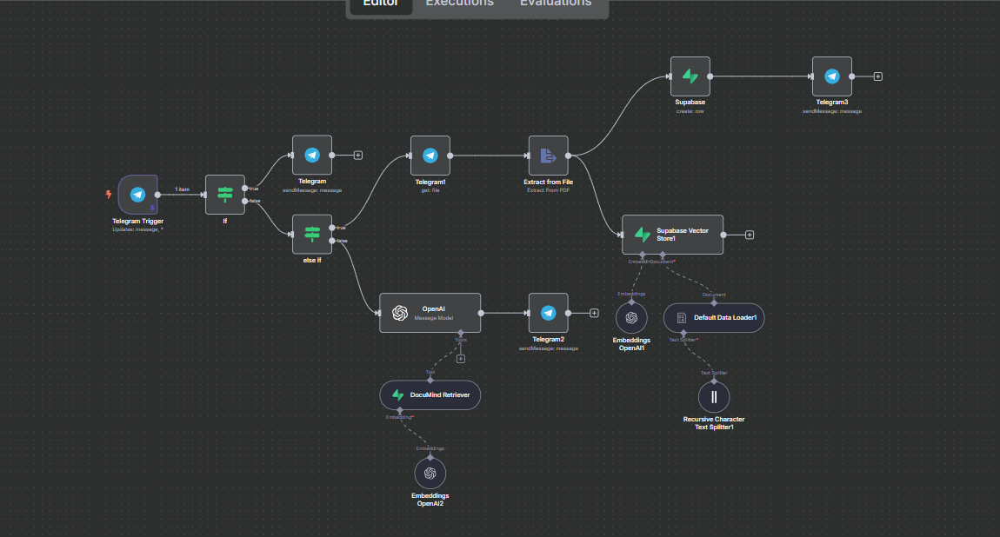

# 🤖 PDF Answering Bot (RAG-based)

---

## 📌 Overview

This project is an **n8n** automation pipeline that turns a **Telegram bot** into a smart **RAG** (**Retrieval-Augmented Generation**) assistant for PDFs.  
It lets users **upload a PDF**, stores its content as vector embeddings in **Supabase**, and uses **OpenAI** to answer questions strictly based on the PDF’s content — **no hallucinations, only grounded answers**.

---

## ⚙️ How It Works

1️⃣ **Telegram Trigger**  
- Listens for `/start` commands or PDF uploads.

2️⃣ **Start Command**  
- If `/start` is sent, the bot replies:  
  **“Send me a PDF”**

3️⃣ **PDF Upload**  
- The bot downloads the file, extracts text, and:
  - Saves it in **Supabase** (`docs` table).
  - Splits the text and creates embeddings with **OpenAI**.
  - Stores embeddings in **Supabase Vector Store** (`docs_vector`).

4️⃣ **Confirmation**  
- The bot replies: **“PDF saved! Ask me anything.”**

5️⃣ **Question Answering (RAG)**  
- When the user asks a question:
  - The question is embedded.
  - The **DocuMind Retriever** searches the vector store for the most relevant chunks.
  - OpenAI generates an answer using **only** those chunks.
  - If no match is found, the bot says:  
    👉 “I couldn’t find the answer in the provided document.”

---

## 🗂️ Data Flow

| Step | Action |
|------|--------|
| 📥 Telegram | Receives commands & PDFs |
| 📄 Extract | Parses PDF content |
| 🧩 Split & Embed | Splits text & generates embeddings |
| 🗃️ Supabase | Stores raw text & vectors |
| 🔍 DocuMind Retriever | Finds relevant text via similarity search |
| 🤖 OpenAI | Generates answer using retrieved chunks |
| 📲 Telegram | Sends the final answer |

---

## 🗃️ Supabase Setup

**Tables:**
- `docs` — Raw PDF text and metadata.
- `docs_vector` — Embeddings for vector search.
- 
---

## 🧰 Technologies Used

- [n8n](https://n8n.io)
- [Telegram Bot API](https://core.telegram.org/bots/api)
- [OpenAI](https://openai.com)
- [Supabase](https://supabase.com)

---
